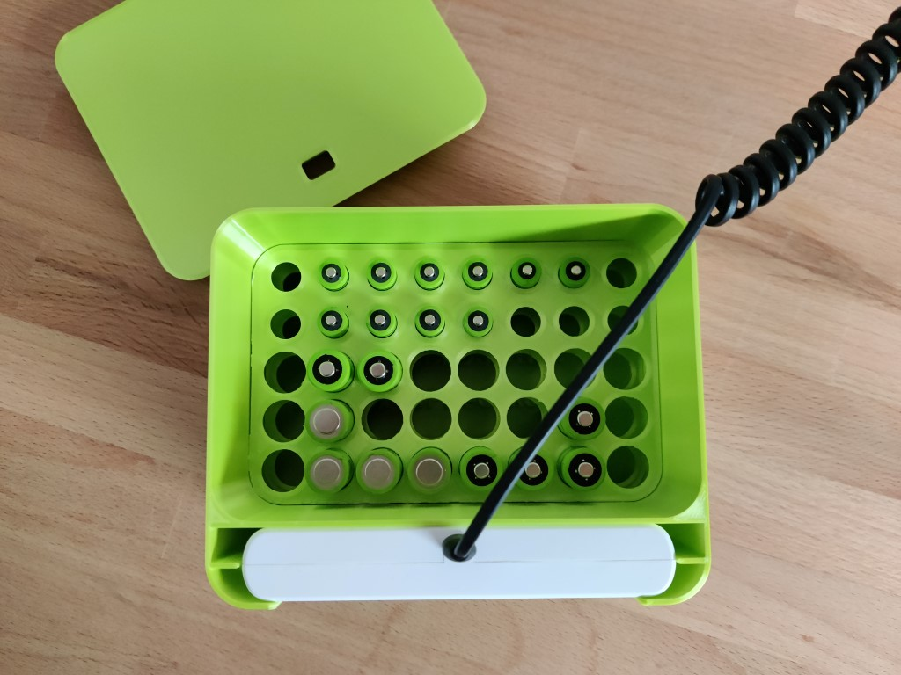
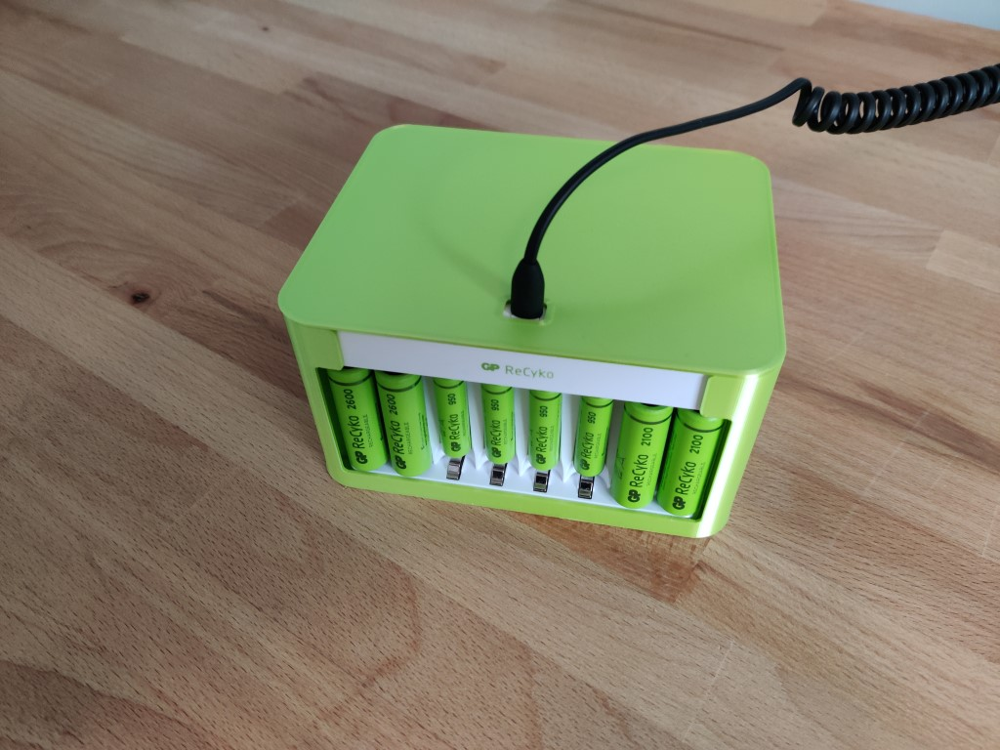

# Introduction

This is a 3D-printed battery box for storage and charging of NiMh batteries of size AA and AAA. It has a slot in the front that fits a charger from GP Batteries (GPReCyko-E811). This charger can handle 8 batteries in pairs of the same type/capacity. If you want to print your own, you only need the stl-files. You need two stacked frames for your selected battery configuration. The 3D-printed box is created by me with [FreeCAD](https://en.wikipedia.org/wiki/FreeCAD).

