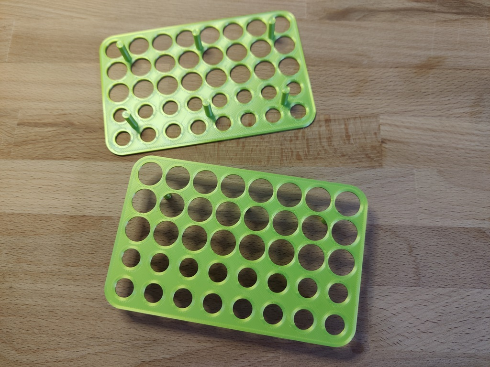

# Introduction

This is a 3D-printed battery box for storage and charging of NiMh batteries of size AA and AAA. It has a slot in the front that fits a charger from GP Batteries (GPReCyko-E811). This charger can handle up to 8 batteries in pairs of the same type/capacity. If you want to 3D-print your own, you only need the stl-files. You need two stacked frames for your selected battery configuration.

## Printer

Printing was done with a Creality Ender 3 v2. This was connected to my home network via a Raspberry Pi 4 with Octoprint software for remote control and viedo monitoring. Slicing was done with Ultimaker Cura, and I configured Cura to to place the seem on the left and back of the box, so it does not show up here and there.

## Filament

The filament I used was eSUN eSilk-PLA 1.75mm i kg - Lime (eSilk-PLA175LI1). This created a very nice finish and was a good match together with the color of my green rechargeable batteries. To achieve this, a filament-dryer is a must, so I invested in a Sunlu FilaDryer S2 to do this print.

## Engineering

The 3D-printed box is made with [FreeCAD](https://en.wikipedia.org/wiki/FreeCAD).

## Pictures

